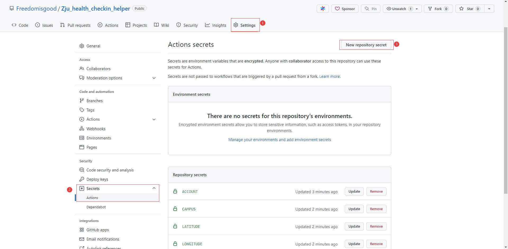
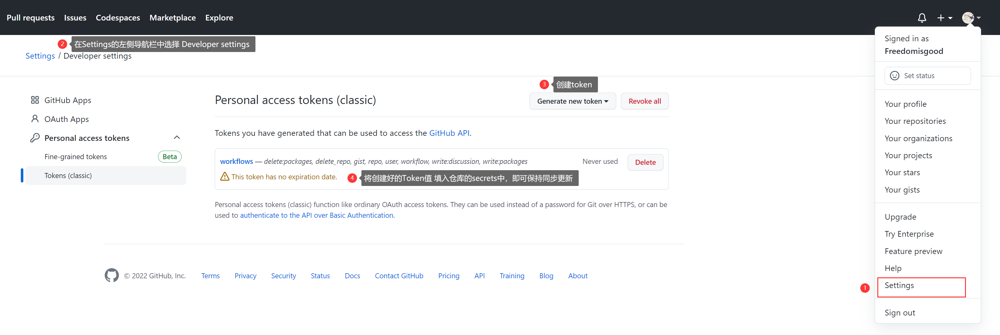

# Health_Checkin_Helper
> 3 < Python < 3.9
> 
> 健康打卡助手- 两种运行方案: 
> - 将脚本部署于服务器上后，使用cron启动定时任务，每日打卡。
> - Github Action: 采用Github提供的服务器进行定时运行脚本, 设置方式见下文
> 
> migrate from: https://github.com/Freedomisgood/When_Coding_in_ZJU/tree/main/Health_Checkin, 考虑到不少同学fork仓库是只是为了打卡代码, 因此
> 决定还是将其抽离出来，作为一个单独的仓库。

## 前置依赖安装

`pip install -r requirements.txt`

注: 由于ddddocr用了不少机器学习的库, 还挺大的, 如果Python比较熟，可以创建虚拟环境使用`virtualenv daka`, `pipenv shell`
## 脚本说明：

~~本工程提供两个脚本二选一使用~~：

- ~~ZJU_Clock_In~~(×, 本仓库不再维护)
- ★ZJU_Health_Checkin_Helper
  - ~~cst: 是IP定位写死宁波浙软的版本~~
  - ~~all: 开放给所有校区同学使用的, 参数可自由填写~~

区别于：[ZJU_Clock_In](https://github.com/lgaheilongzi/ZJU-Clock-In) 的地方是，ZJU_Clock_In采用的是利用缓存数据提交，如果没有缓存数据则需要手动先打一次卡；而Health_Checkin_Helper**没有这个限制**，直接可以打卡，并且可以**设置打卡位置**。

## 设置打卡位置说明：

1. 直接运行 main.py 脚本: `python main.py -a * -p * -lng 121.63529 -lat 29.89154 -c 宁波校区`
   - 如果不清楚参数设置可以运行`python main.py --help`, 查看参数帮助
   - 校区填写参考钉钉中显示的文本:
     - 紫金港校区
     - 玉泉校区
     - 西溪校区
     - 华家池校区
     - 之江校区
     - 海宁校区
     - 舟山校区
     - 宁波校区
     - 工程师学院
     - 杭州国际科创中心
   
   ▲注: 如果选择"校外", 则运行`python main.py -a * -p * -lng 121.63529 -lat 29.89154 -c NO`, 即CAMPUS参数填写NO
   - 经纬度参数值，可以通过 [经纬度查询](https://map.bmcx.com/) 网站来获得
2. 将脚本放在服务器上cron定时执行: `05 12 * * * python /home/mrli/dscripts/app/zju/main.py -a * -p * -lng 121.63529 -lat 29.89154 -c 宁波校区`
3. GithubAction: Fork仓库后, 根据要求参数填写secrets(填写提示在下面↓), 然后在仓库的`Actions`标签页中手动点击`Enable workflow`来启动触发workflow设置。
   - 打卡时间由`.github/workflows/run_check.yml`文件中的`cron: 45 0 * * *`配置, 需要修改的可`fork`后自行修改

注: 如果使用了`pipenv`, 定时任务为: `30 10 * * * bash /home/mrli/dscripts/app/zju/start.sh` 
```bash
# !/usr/bin/bash
# start.sh
set -e
cd `dirname $0`
pipenv run python main.py -a * -p * -lng 121.63529 -lat 29.89154 -c 宁波校区
```

## 推送功能:
> 需要修改`push_config.ini`内容, 对于Github Action没作参数支持(如果要使用, 请fork后修改`push_config.ini`再Start Action)
>
> 如果没设置`pusher_type`则不推送
> 
> 注: **如果要PR, 请关注下`pusher.py`文件的内容**

```ini
[pusher]
# pusher_type可填写[serverchan, dingding, pushplus]其中一个
pusher_type =
push_title = 健康打卡

# https://sct.ftqq.com/
[serverchan]
sec_key =

# https://open.dingtalk.com/document/group/custom-robot-access
[dingding]
access_token =
secret =

# http://www.pushplus.plus/
[pushplus]
pushplus_token = 
```


## 更新日志：
- 2022年11月24日: 完善抓包参数对比工具 + 修改抓取新参数
- 2022年8月17日: 修复[issue#1](https://github.com/Freedomisgood/Zju_health_checkin_helper/issues/1): 校外参数错误
- 2022年8月13日: 暑假版本变化: 新增是否在校、实习选项
- 2022年5月10日: 迁移仓库, 增加Github Action, 丰富pusher推送功能
- 2022年5月8日: 增加验证码识别, 使用ddddocr库完成, 由于onnruntime需要<Py3.9, 所以现在只支持Python3-3.9
- 2021年9月19日: 执行run中增加随机数延时，以实现每次打卡时间不同。
- 2021年9月17日: Done V1~
- 2021年10月17日：打卡接口数据有所调整，不再需要uid和id参数，因此在正则匹配上删除了这两个参数
- 2021年12月5日: 紫金港有疫情情况, 表单参数有所改变

# 附Github Action参数填写提醒
1. 有需要用Github action的需要填写6个参数
- GITHUB_TOKEN: 为了与本仓库更新同步, 如果没有则不保持同步
- ACCOUNT: 统一认证账号(*必填)
- PASSWORD: 统一认证账号密码(*必填)
- LONGITUDE: 经度(*必填)
- LATITUDE: 纬度(*必填)
- CAMPUS: 校区(可选): 不填时采用"不在在校"选项

**GithubAction secrets参数填写教程图**:

- 必须参数填写说明: 

- 仓库同步操作教程
